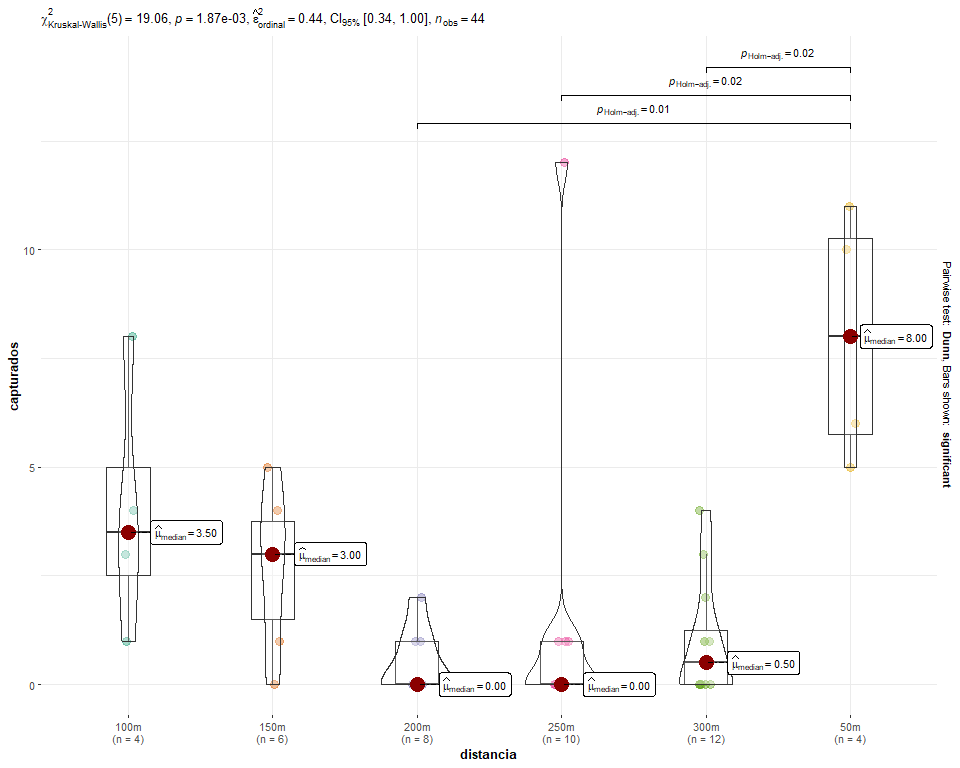

Análisis de Capturas del Barrenador
================
Dr. Byron González

- [Introducción](#introducción)

## Introducción

Se presenta el desarrollo analítico para determinar si existen
diferencias significativas en el número de barrenadores capturados a
diferentes distancias. Se utiliza la prueba no paramétrica de
Kruskal-Wallis seguida de una prueba post-hoc de Dunn para comparaciones
múltiples

### 1. Carga de bibliotecas

El siguiente bloque de código se encarga de cargar todas las bibliotecas
necesarias para el análisis

``` r
# Este patrón verifica si un paquete está instalado y, si no, lo instala.
if(!require(readxl)){install.packages("readxl")}
if(!require(stats)){install.packages("stats")}
if(!require(ggstatsplot)){install.packages("ggstatsplot")}
if(!require(PMCMRplus)){install.packages("PMCMRplus")}
if(!require(FSA)){install.packages("FSA")}
if(!require(rcompanion)){install.packages("rcompanion")}
```

### 2. Importación de datos

Se importan los datos desde el archivo `barrenador.xlsx`. Luego, se
muestran las primeras filas del conjunto de datos con `head()` para
verificar que la importación se haya realizado correctamente y contar
con una primera vista de la estructura de los datos

``` r
# Importar la tabla "barrenador"
barr <- read_excel("barrenador.xlsx")
head(barr)
```

    ## # A tibble: 6 × 2
    ##   distancia capturados
    ##   <chr>          <dbl>
    ## 1 50m               11
    ## 2 50m               10
    ## 3 50m                5
    ## 4 50m                6
    ## 5 100m               1
    ## 6 100m               8

### 3. Prueba de Kruskal-Wallis

Dado que se sospecha que los datos no siguen una distribución normal, se
emplea la prueba de Kruskal-Wallis, que es una alternativa no
paramétrica al ANOVA de una vía Esta prueba nos permite determinar si
existen diferencias estadísticamente significativas en las medianas del
número de capturas entre los diferentes grupos de distancia.

``` r
# Calcular el estadístico de prueba
resultado <- kruskal.test(capturados ~ distancia, data = barr)
resultado
```

    ## 
    ##  Kruskal-Wallis rank sum test
    ## 
    ## data:  capturados by distancia
    ## Kruskal-Wallis chi-squared = 19.063, df = 5, p-value = 0.001871

### 4. Prueba Post-Hoc de Dunn

Si el resultado de la prueba de Kruskal-Wallis es significativo
(generalmente p \< 0.05), indica que hay una diferencia en al menos un
par de grupos. Para identificar cuáles pares de grupos son diferentes,
realizamos una prueba post-hoc de Dunn. Se emplea el método de ajuste de
Benjamini-Hochberg (`"bh"`) para controlar la tasa de falsos
descubrimientos en las comparaciones múltiples

``` r
# Prueba de Dunn para comparaciones múltiples
dunn_resultado <- dunnTest(capturados ~ distancia,
                           data = barr,
                           method = "bh")

# Extraer la tabla de comparaciones en pares
tabla_comparaciones <- dunn_resultado$res
print(tabla_comparaciones)
```

    ##     Comparison          Z      P.unadj       P.adj
    ## 1  100m - 150m  0.5661462 0.5712944276 0.659185878
    ## 2  100m - 200m  2.3539279 0.0185762146 0.069660805
    ## 3  150m - 200m  1.9924293 0.0463239806 0.099265673
    ## 4  100m - 250m  2.2100509 0.0271016272 0.081304882
    ## 5  150m - 250m  1.8242487 0.0681144773 0.127714645
    ## 6  200m - 250m -0.2824900 0.7775677951 0.777567795
    ## 7  100m - 300m  2.0337112 0.0419807175 0.104951794
    ## 8  150m - 300m  1.6174359 0.1057842165 0.176307027
    ## 9  200m - 300m -0.5856618 0.5581028093 0.697628512
    ## 10 250m - 300m -0.3113685 0.7555204880 0.809486237
    ## 11  100m - 50m -0.8757200 0.3811822618 0.519793993
    ## 12  150m - 50m -1.5254494 0.1271470526 0.190720579
    ## 13  200m - 50m -3.3651223 0.0007650975 0.011476462
    ## 14  250m - 50m -3.2567366 0.0011270098 0.008452573
    ## 15  300m - 50m -3.1062448 0.0018947975 0.009473988

### 5. Generación de letras de significación (Compact Letter Display)

Para facilitar la interpretación de los resultados de la prueba de Dunn,
se genera un “Compact Letter Display”. A los grupos que no son
significativamente diferentes entre sí se les asigna la misma letra.
Esto permite visualizar rápidamente qué grupos son similares y cuáles
son distintos

``` r
# Generar las letras 
cartas_significancia <- cldList(P.adj ~ Comparison,
                                data = tabla_comparaciones, 
                                threshold = 0.05,
                                remove.zero = FALSE) # <--- ESTO EVITA EL ERROR
print(cartas_significancia)
```

    ##   Group Letter MonoLetter
    ## 1  100m     ab         ab
    ## 2  150m     ab         ab
    ## 3  200m      a         a 
    ## 4  250m      a         a 
    ## 5  300m      a         a 
    ## 6   50m      b          b

### 6. Creación de tabla de Resumen (Estilo Tukey)

Finalmente, se combinan los resultados de las letras de significación
con las medianas de cada grupo para crear una tabla de resumen clara y
ordenada La tabla se ordena de mayor a menor según la mediana de
capturas, mostrando la distancia, su mediana y la letra de significación
correspondiente.

``` r
# Calcular las medianas de capturas para cada distancia
medianas <- aggregate(capturados ~ distancia, data = barr, FUN = median)
colnames(medianas) <- c("Group", "Mediana")

# Fusionar las tablas por la columna común "Group"
tabla_estilo_tukey <- merge(medianas, cartas_significancia, by = "Group")

# Ordenar de mayor a menor según la mediana y seleccionar columnas limpias
tabla_estilo_tukey <- tabla_estilo_tukey[order(-tabla_estilo_tukey$Mediana), c("Group", "Mediana", "Letter")]

# Imprimir el resultado final ordenado
print(tabla_estilo_tukey)
```

    ##   Group Mediana Letter
    ## 6   50m     8.0      b
    ## 1  100m     3.5     ab
    ## 2  150m     3.0     ab
    ## 5  300m     0.5      a
    ## 3  200m     0.0      a
    ## 4  250m     0.0      a

### 7. Visualización gráfica con `ggstatsplot`

Una excelente forma de comunicar los resultados es a través de una
visualización. La biblioteca `ggstatsplot` permite crear un gráfico que
combina los datos brutos (diagrama de cajas), los resultados de la
prueba de Kruskal-Wallis y las comparaciones por pares significativas,
todo en una sola figura

``` r
# Resolución mediante ggstatsplot
ggbetweenstats(
  data = barr,
  x = distancia,
  y = capturados,
  type = "nonparametric", # ANOVA para Kruskall-Wallis
  plot.type = "box",
  pairwise.comparisons = TRUE,
  pairwise.display = "significant",
  centrality.plotting = TRUE,
  bf.message = FALSE
)
```

<!-- -->
